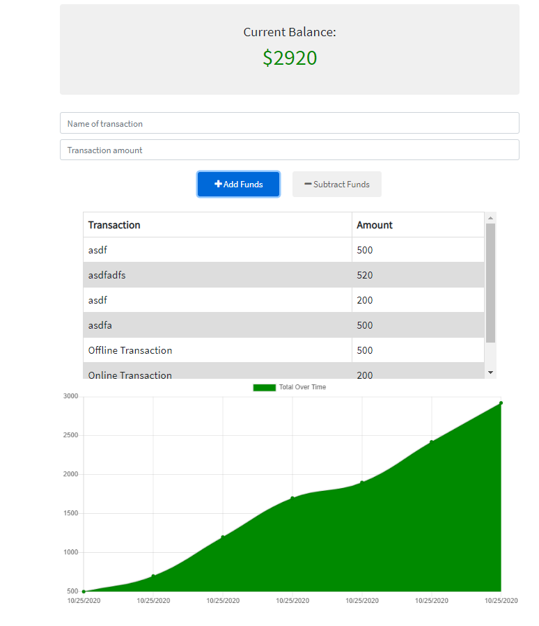

  
# Budget_Tracker

## Description 
The purpose of this project was to create a budget tracker where the user can see their entries on and offline. When the user gets back online, they can see the entries they entered while offline.

## Project Demonstration
  

## Table of contents

- [Description](#description)
- [Installation](#installation)
- [Usage](#usage)
- [License](#license)
- [Contributing](#contributing)
- [Questions](#questions)
- [Repository Link](#repository)

## Installation

        N/A

## Usage

        Go to this website > https://budget-tracker-kj.herokuapp.com/ and enter your transactions. 

## License
MIT 

## Contributing

The owner of this project is KJ-Labs, you're welcome to contribute.

## Questions

- If you have any questions, please contact me on Github.
- [KJ-Labs](https://github.com/KJ-Labs)

## Repository

- [Project Repo](https://github.com/KJ-Labs/Budget_Tracker)

## Screenshots
  

